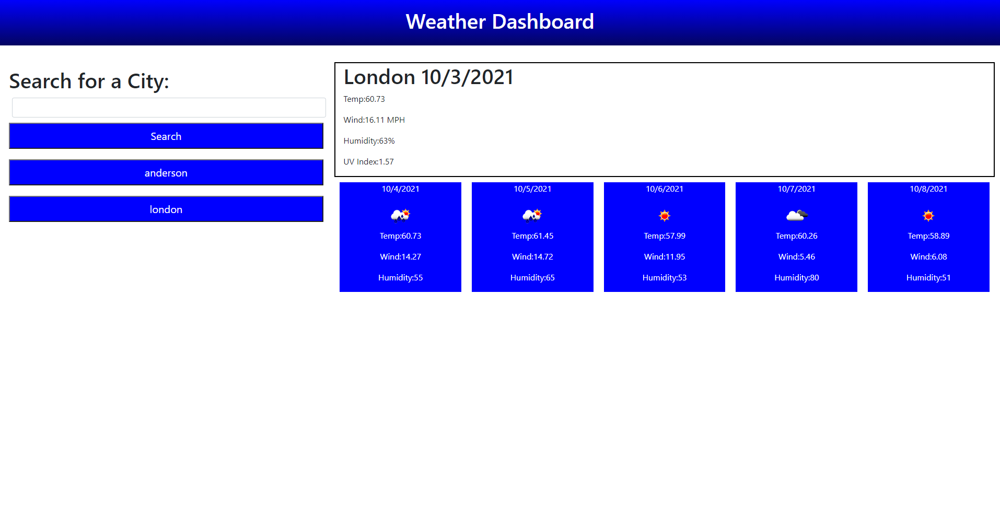

# Weather Dashboard

[Link To Deployed Website](https://tmcrocker89.github.io/WeatherDashboard/)

This is my Weather Dashboard, you can enter a city and it will return the current weather and the 5 day forcast. It will also store your search and create a button for your search for quick use later. The clear search button in the header will clear your search history and refresh the page. If you misspell a city, or type in something not a city name, you will get a error pop up that tells you to check the city name or spelling.

